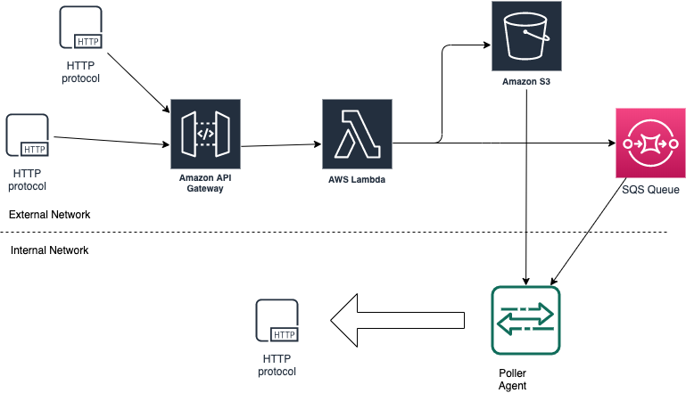

# ProxyTea

## What is ProxyTea?

ProxyTea is a neat and cost-effective solution to forward HTTP Requests to an internal network.

## How does it work?

ProxyTea is based on two connected components:

- Proxy: A simple AWS Stack, including an API Gateway, a SQS Queue and an S3 Bucket to temporary store body payloads.
- Tea: a command line tool to run locally, pulling requests from the SQS Queue and forwarding them to your local service.



## What do I need ?

In the first place, you need a AWS account and the AWS CLI properly configured in your workstation, along with the SAM CLI.

You can follow the official instructions at [AWS](https://docs.aws.amazon.com/cli/index.html) and [SAM CLI](https://docs.aws.amazon.com/serverless-application-model/index.html).


## How to deploy Proxy?

An S3 bucket to store the deployment code is required.

```sh
$> git clone git@github.com:12Tech/proxytea.git
$> cd proxytea/src/proxy
$> sam deploy --debug --s3-bucket DEPLOYMENT_BUCKET --force-upload --stack-name YOUR_STACK_NAME
```

Once the stack is correctly deployed, the API Gateway Endpoint will be shown.

## How to use Tea?

```sh
$> cd proxytea/src/pytea
$> python tea.py -u http://YOUR_LOCAL_SERVICE:PORT -q https://QUEUE_URL
```

The agent will start forwarding requests from the public API Gateway Endpoint to your local service.

